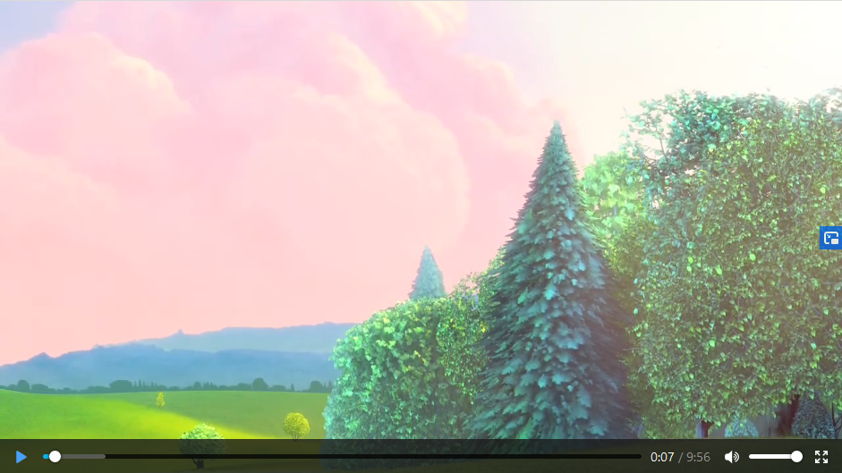
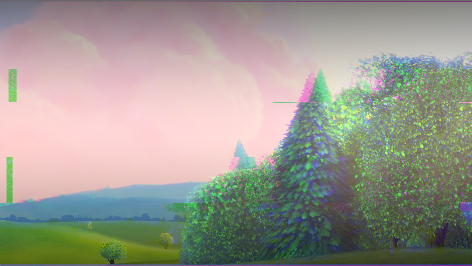

Web Glitch-This
===============

This is a simple port to Javascript from the [Glitch-This](https://github.com/TotallyNotChase/glitch-this) cli-program made by TotallyNotChase.

The **ImageGlitcher** class holds all the original methods and require only changes on the pixels buffers parameters.

I just though it was fun to have it applied to an HTML5 video object , so the glitch is applied per-frame on _realtime_.

You could just change the default _Big Buck Bunny_ video to your own, as long as it is browser-valid, and change the glitch values on the fly.

Have fun ;)

#### Demo

Live browser demo can be checked in the [Github Pages](https://pahefu.github.io/web-glitch-this/).


#### Special parameters

The **ImageGlitcher** methods expect a Javascript object as:

```
let image_data = {
    input : ctx_a.ImageData.getImageData(0,0,w,h), // ImageData object obtained from Source canvas context
    output: ctx_b.ImageData.getImageData(0,0,w,h),// ImageData object obtained from Destination canvas context
    width : w, // Width of the source image
    height: h // Height of the source image
 };
```

The functions overwrite the pixel data on the **output** variable.

#### Provided example

If running on _Big Buck Bunny_ we will go from this:



To this glitched outcome:

